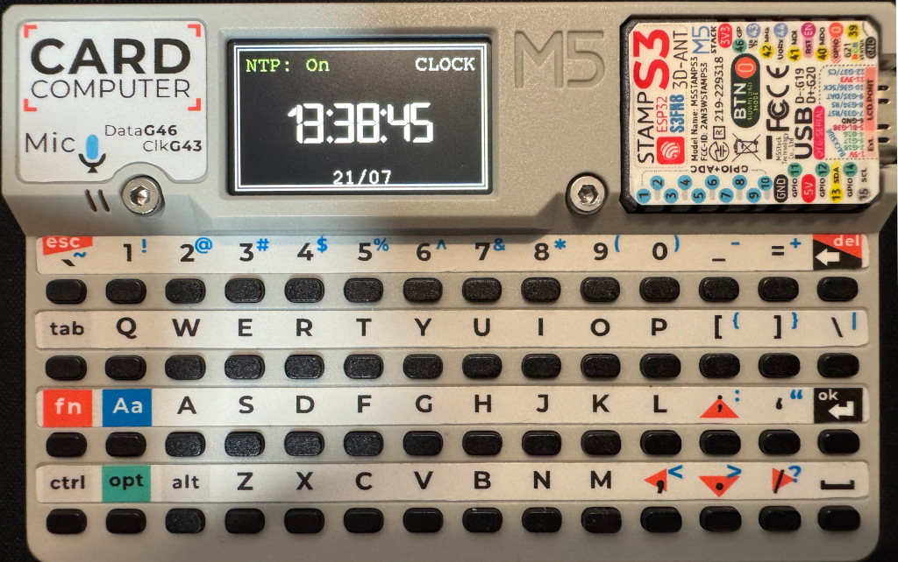
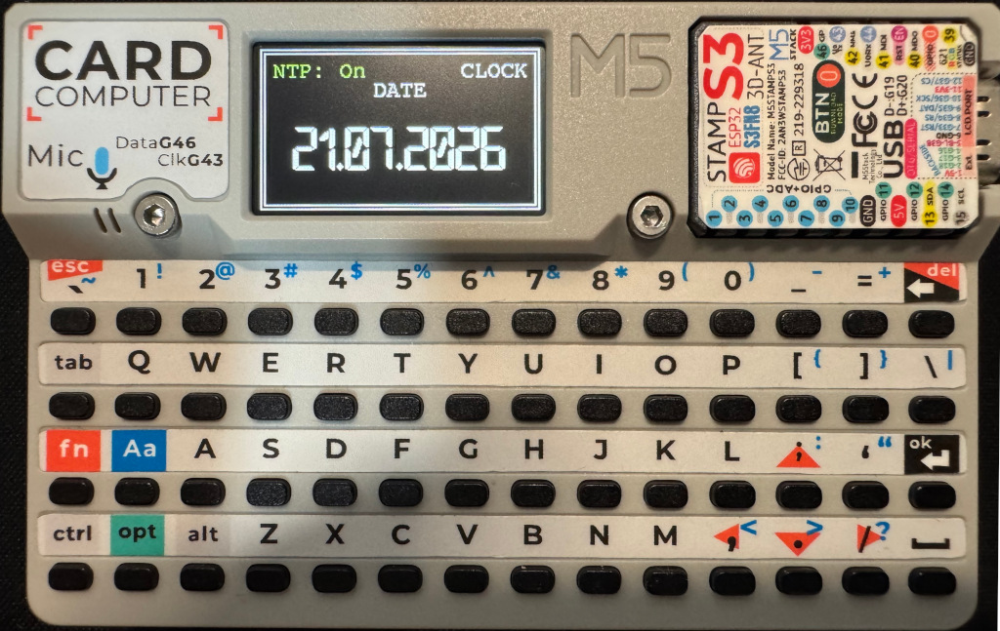

# M5Cardputer Clock with SD Config

> Стильные электронные часы для M5Cardputer с синхронизацией времени по NTP, конфигурацией через JSON-файл на SD-карте и крупным кастомным шрифтом.

## 📦 Возможности

- **Точное время** — синхронизация с NTP-сервером (с поддержкой ручной синхронизации по нажатию кнопки).
- **Переключение режимов** — отображение времени или полной даты (по пробелу).
- **Крупный шрифт** — часы хорошо видны с расстояния.
- **Без мерцания** — вся отрисовка выполняется через буфер (спрайт).
- **Конфигурация через SD-карту** — Wi-Fi и часовой пояс задаются в файле `clock.json`.
- **Работа без SD** — если карта отсутствует или файл повреждён, используются значения по умолчанию.
- **Индикация подключения** — статус NTP отображается на экране (зелёный/красный).

## 🖥️ Управление

| Клавиша | Действие |
| :--- | :--- |
| `Пробел` | Переключить отображение: время ↔ дата |
| `Ctrl` | Принудительная синхронизация времени по NTP |
| Другие клавиши | Не используются |

> **Примечание:** Клавиша `Ctrl` — это кнопка с символом Ctrl (или `Fn + Shift` в некоторых раскладках).

## ⚙️ Настройка через SD-карту

Создайте на SD-карте (формат FAT32) файл `/clock.json` со следующим содержимым:

```json
{
  "ssid": "MyWiFi",
  "password": "MyPassword123",
  "gmtOffset": 10800,
  "ntpServer": "pool.ntp.org"
}
```

### Параметры конфигурации

| Параметр | Тип | Обязательный | Пояснение |
| :--- | :--- | :--- | :--- |
| `ssid` | строка | ✅ Да | Имя Wi-Fi сети. |
| `password` | строка | ✅ Да | Пароль Wi-Fi. |
| `gmtOffset` | число | ✅ Да | Смещение часового пояса от UTC в секундах (например, для Москвы +3:00 → `10800`). |
| `ntpServer` | строка | ❌ Нет | Адрес NTP-сервера. По умолчанию: `pool.ntp.org`. |

**Примеры смещения (`gmtOffset`):**
- Нью-Йорк (зима): `-18000` (UTC-5)
- Токио: `32400` (UTC+9)

> Если файл отсутствует или не парсится, прошивка использует встроенные значения по умолчанию (заданы в коде).

## 🔧 Установка

### Требования
- **Платформа:** M5Cardputer (или совместимая с M5Stack).
- **Среда разработки:** Arduino IDE / PlatformIO.

### Библиотеки
- `M5Cardputer` (встроенная)
- `M5GFX` (встроенная)
- `ArduinoJson` (установить через менеджер библиотек, версия 6.x)
- `WiFi` (встроенная)
- `time.h` (встроенная)
- **Кастомный шрифт:** `Open_24_Display_St24pt7b.h` (прилагается в репозитории).

### Шаги установки
1. Скачайте репозиторий или скопируйте код в новый скетч Arduino.
2. Установите библиотеку **ArduinoJson**:
   - В Arduino IDE: *Скетч → Подключить библиотеку → Управление библиотеками...* → найдите `ArduinoJson` → установите версию 6.x.
3. Подключите шрифт:
   - Поместите файл `Open_24_Display_St24pt7b.h` в папку со скетчем.
   - *(Файл шрифта можно сгенерировать через LVGL Font Converter или взять из примеров).*
4. Настройте пины для SD (по умолчанию CS = 4).
5. Загрузите прошивку на M5Cardputer через USB.
6. Вставьте SD-карту с файлом `clock.json` и включите устройство.

## 🗂️ Структура проекта

```text
/
├── clock.ino                      # Основной код
├── Open_24_Display_St24pt7b.h     # Кастомный шрифт
├── README.md                      # Эта документация
└── (SD-карта)
    └── clock.json                 # Файл конфигурации
```

## 🧪 Тестирование

После загрузки прошивки на экране появится надпись `Connecting WiFi...`, затем статус подключения. Если всё успешно — отобразится текущее время.

- Нажмите **пробел** для переключения на дату.
- Нажмите **Ctrl** для принудительной синхронизации с NTP (на экране появится `NTP syncing...`).

## ⚠️ Решение проблем

| Проблема | Возможное решение |
| :--- | :--- |
| Не подключается Wi-Fi | Проверьте правильность SSID и пароля в `clock.json`. |
| Время не обновляется | Проверьте интернет-соединение и NTP-сервер. Попробуйте синхронизировать вручную (`Ctrl`). |
| Не читается SD-карта | Проверьте формат (FAT32), контакты карты, пин CS (попробуйте 4, 5 или 14). |
| Мерцание экрана | Убедитесь, что используется спрайт (в коде используется `M5Canvas`). |
| Ошибка компиляции "ArduinoJson" | Установите библиотеку через менеджер. |
| Шрифт не отображается | Проверьте, что файл `Open_24_Display_St24pt7b.h` лежит в папке со скетчем. |

## 🛠️ Изменение настроек по умолчанию

Если SD-карта не используется, можно изменить значения в коде:

```cpp
const char* default_ssid = "YOU_SSID";
const char* default_password = "YOU_SSID_PASSWORD";
const char* default_ntpServer = "pool.ntp.org";
long default_gmtOffset = 10 * 3600;
```

Также можно изменить поведение клавиш или добавить другие функции — код хорошо структурирован.

## 📜 Лицензия

Проект распространяется под лицензией **Apache 2.0**.  
**Автор:** Arktopru




